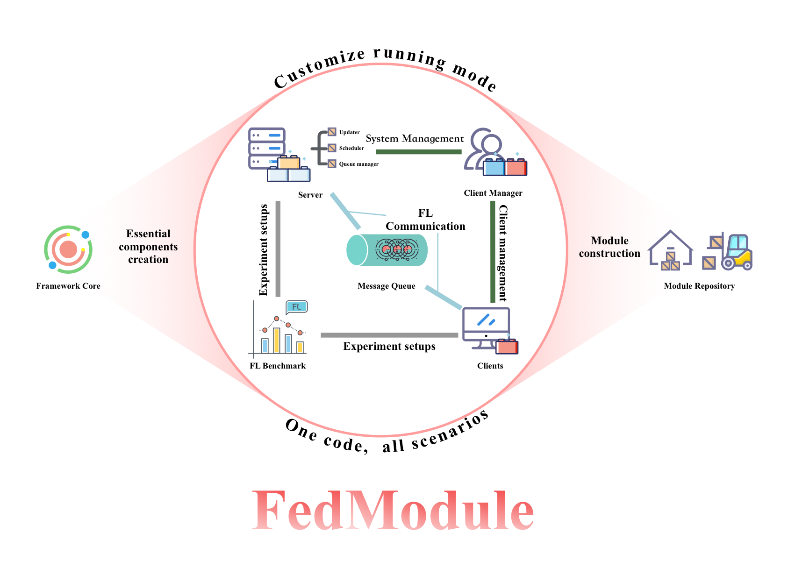

# Async-FL

</img>


[](./license)


> This document is also available in: [中文](doc/readme-zh.md) | [English](readme.md)

> keywords: `federated-learning`, `asynchronous`, `synchronous`, `semi-asynchronous`

<details>
  <summary><b>Table of Contents</b></summary>
  <p>

- [Original Intention](#original-intention)
- [Git Branch Description](#git_branch-description)
- [Requirements](#requirements)
- [Getting Started](#getting-started)
  - [Experiments](#experiments)
  - [Docker](#docker)
- [Features](#features)
- [Project Directory](#project-directory)
- [Framework](#Framework)
- [Code Explanations](#code-explanations)
  - [Receiver Class](#receiver-class)
  - [Checker Class](#checker-class)
- [Configuration](#Configuration)
  - [Asynchronous Configuration](#asynchronous-configuration)
  - [Synchronous Configuration](#synchronous-configuration)
  - [Semi-aynchronous Configuration](#semi-aynchronous-configuration)
- [Adding New Algorithm](#adding-new-algorithm)
  - [Adding Loss Function](#adding-loss-function)
- [Staleness Settings](#staleness-settings)
- [Non-iid Settings](#non-iid-settings)
  - [label_iid](#label_iid)
  - [data_iid](#data_iid)
- [Adding New Client Class](#adding-new-client-class)
- [Multi-GPU](#multi-gpu)
- [Existing Bug](#existing-bug)
- [Contact Us](#contact-us)

  </p>
</details>

## Original Intention

The initial intention of this project is to build an asynchronous federated learning framework and conduct experiments on it during my undergraduate thesis.

However, when I tried to search for related open-source projects on GitHub, I found that the field of asynchronous federated learning is quite closed-source, with almost no open-source projects available. Additionally, mainstream frameworks also lack compatibility with asynchronous FL and only support synchronous FL. Thus, this project was born.

## Git Branch Description

The master branch is the main branch with the latest code, but some of the commits are dirty commits and not guaranteed to run properly. It is recommended to use tagged versions for better stability.

The checkout branch retains the functionality of adding clients to the system during the training process, which has been removed in the main branch. The checkout branch is not actively maintained and only supports synchronous and asynchronous FL.

## Requirements

python3.8 + pytorch + macos

It has been validated on Linux.

It supports single GPU and Multi-GPU.

## Getting Started

### Experiments
You can run `python main.py` (the main file in the fl directory) directly. The program will automatically read the `config.json` file in the root directory and store the results in the specified path under `results`, along with the configuration file.

You can also specify the configuration file by `python main.py config.json`. Please note that the path of `config.json` is relative to the root directory, not `main.py`.

The `config` folder in the root directory provides some algorithm configuration files proposed in papers. The following algorithm implementations are currently available:

```text
FedAvg
FedAsync
FedProx
FedAT
FedLC
```

### Docker

Now you can directly pull and run a Docker image, the command is as follows:

```shell
docker pull desperadoccy/async-fl
docker run -it async-fl config/FedAvg-config.json
```

Similarly, it supports passing a config file path as a parameter. You can also build the Docker image yourself.

```shell
cd docker
docker build -t async-fl .
docker run -it async-fl config/FedAvg-config.json 
```

## Features

- [x] Asynchronous Federated Learning
- [x] Support model and dataset replacement
- [x] Support scheduling algorithm replacement
- [x] Support aggregation algorithm replacement
- [x] Support loss function replacement
- [x] Support client replacement
- [x] Synchronous federated learning
- [x] Semi-asynchronous federated learning
- [x] Provide test loss information
- [x] Custom label heterogeneity
- [ ] Custom data heterogeneity
- [ ] Support for generating `Synthetic Non-Identical Client Data`生成;[related paper](https://arxiv.org/pdf/1909.06335.pdf)
- [x] wandb visualization
- [ ] Support for leaf-related datasets
- [x] Support for multiple GPUs
- [x] Docker deployment

## Project Directory

```text
.
├── config                                    Common algorithm configuration files
│   ├── FedAT-config.json
│   ├── FedAsync-config.json
│   ├── FedAvg-config.json
│   └── FedProx-config.json
├── config.json                               configuration files
├── config_semi.json                          configuration files
├── config_semi_test.json                     configuration files
├── config_sync.json                          configuration files
├── config_sync_test.json                     configuration files
├── config_test.json                          configuration files
├── fedsemi.png
├── framework.png
├── readme.md
├── requirements.txt
└── src 
    ├── client                                Client implementation
    │   ├── AsyncClient.py                    Asynchronous client class
    │   ├── Client.py                         Client  class
    │   ├── ProxClient.py
    │   ├── SemiClient.py
    │   ├── SyncClient.py                     Synchronous client class
    │   └── __init__.py
    ├── data                                  Dataset download location
    ├── dataset                               Dataset class
    │   ├── CIFAR10.py
    │   ├── MNIST.py
    │   ├── FashionMNIST.py
    │   └── __init__.py
    ├── exception                             Exception class
    │   ├── ClientSumError.py
    │   └── __init__.py
    ├── fedasync                              Asynchronous Federated Learning
    │   ├── AsyncClientManager.py             Client Manager class
    │   ├── AsyncServer.py                    Server class
    │   ├── SchedulerThread.py                Scheduling Thread
    │   ├── UpdaterThread.py                  Aggregation Thread
    │   └── __init__.py
    ├── fedsemi                               Semi-asynchronous Federated Learning
    │   ├── QueueManager.py                   Message Queue Manager class
    │   ├── SchedulerThread.py                Scheduling Thread
    │   ├── SemiAsyncClientManager.py         Client Manager class
    │   ├── SemiAsyncServer.py                Server class
    │   ├── UpdaterThread.py                  Aggregation Thread
    │   ├── __init__.py
    │   ├── checker                           Semi-asynchronous checker
    │   │   └── SemiAvgChecker.py
    │   ├── grouping                          Partitioner
    │   │   ├── Grouping.py
    │   │   ├── NormalGrouping.py
    │   │   └── SimpleGrouping.py
    │   └── receiver                          Semi-asynchronous receiver
    │       └── SemiAvgReceiver.py
    ├── fedsync                               Synchronous Federated Learning
    │   ├── QueueManager.py                   Queue Manager class
    │   ├── SchedulerThread.py                Scheduling Thread
    │   ├── SyncClientManager.py              Client Manager class
    │   ├── SyncServer.py
    │   ├── UpdaterThread.py
    │   ├── __init__.py
    │   ├── checker                           Synchronous Checker
    │   │   └── AvgChecker.py
    │   └── receiver                          Synchronous Receiver
    │       └── AvgReceiver.py
    ├── fl                                    fl main function
    │   ├── __init__.py
    │   ├── main.py
    │   └── wandb                             wandb running directory
    ├── loss                                  Implementation of Loss Function
    │   └── __init__.py
    ├── model
    │   ├── CNN.py
    │   ├── ConvNet.py
    │   └── __init__.py
    ├── results
    ├── schedule                              Scheduling Algorithm Class
    │   ├── FullSchedule.py
    │   ├── RandomSchedule.py
    │   ├── RoundRobin.py
    │   └── __init__.py
    ├── test                                  for test
    ├── update                                Updating Algorithm Class
    │   ├── AsyncAvg.py
    │   ├── FedAT.py
    │   ├── FedAsync.py
    │   ├── FedAvg.py
    │   ├── MyFed.py
    │   └── __init__.py
    └── utils                               
        ├── ConfigManager.py
        ├── IID.py
        ├── JsonTool.py
        ├── ModuleFindTool.py
        ├── Plot.py
        ├── ProcessTool.py
        ├── Queue.py
        ├── Random.py
        ├── Time.py
        ├── Tools.py
        └── __init__.py
```

The "Time" file under the "utils" package is an implementation of a multi-threaded time acquisition class, and the "Queue" file is an implementation of related functionalities for the "queue" module, as some functionalities of the "queue" module are not yet implemented on macOS.
## Framework


## Code Explanations

### Receiver Class

The receiver in synchronous and semi-asynchronous federated learning is used to check whether the updates received during the current global iteration meet the conditions set, such as whether all designated clients have uploaded their updates. If the conditions are met, the updater process will be triggered to perform global aggregation.

### Checker Class

In synchronous and semi-asynchronous federated learning, after a client completes its training, it will upload its weights to the uploader class, which will determine whether the update meets the upload criteria based on its own logic, and decide whether to accept or discard the update.

## Configuration

### Asynchronous Configuration

```text
{
  "wandb": {                                  wandb configuration
    "enabled": true,                         
    "project": "non-iid test",                  
    "name": "1"                               Name of this Run Result
  },
  "global": {
    "multi_gpu": true,                        
    "mode": "async"                           sync｜async｜semi-async
    "experiment": "TMP/test/1",               Experiment path/result storage path
    "stale": {                                staleness setting
      "step": 1,                              
      "shuffle": true,                        
      "list": [10, 10, 10, 5, 5, 5, 5]        The number of clients corresponding to each step size
    },
    "data_file": "MNIST",                     Data set class file
    "data_name": "MNIST",                     Data set class name
    "iid": {                                  non-iid setting
      "label": {
        "step": 1,
        "list": [10, 10, 30]
      },
      "data": {
        "max": 200,
        "min": 200
      }
    },
    "client_num": 50                          
  },
  "server": {
    "epochs": 600,                            global epoch
    "model_file": "CNN",                      
    "model_name": "CNN",                      
    "scheduler": {
      "scheduler_interval": 5,                
      "schedule_file": "RandomSchedule",      
      "schedule_name": "RandomSchedule",      
      "params": {                             Scheduling algorithm related parameters
        "c_ratio": 0.1,
        "schedule_interval": 5
      }
    },
    "updater": {
      "update_file": "MyFed",                 
      "update_name": "MyFed",                 
      "loss": "cross_entropy",                
      "params": {                             
        "a": 10,
        "b": 4,
        "alpha": 0.1,
        "r" : 1,
        "c" : 2,
        "d" : 2
      }
    }
  },
  "client_manager": {
    "client_file": "AsyncClient",             
    "client_name": "AsyncClient"              
  },
  "client": {
    "epochs": 2,                              local epoch
    "batch_size": 50,
    "model_file": "CNN",                      
    "model_name": "CNN",                      
    "loss": "cross_entropy",                  
    "mu": 0.01,                               proximal term coefficient
    "optimizer": {                            
      "name": "Adam",
      "weight_decay": 0.005,
      "lr": 0.01
    }
  }
}
```

### Synchronous Configuration

```text
{
  "wandb": {                                  
    "enabled": true,                          
    "project": "non-iid test",                  
    "name": "1"                               
  },
  "global": {
    "multi_gpu": true,                        
    "mode": "async"                           sync｜async｜semi-async
    "experiment": "TMP/test/1",               Experiment path/result storage path
    "stale": {                                staleness setting
      "step": 1,                              
      "shuffle": true,                        
      "list": [10, 10, 10, 5, 5, 5, 5]        The number of clients corresponding to each step size
    },
    "data_file": "MNIST",                     Data set class file
    "data_name": "MNIST",                     Data set class name
    "iid": {                                  non-iid setting
      "label": {
        "step": 1,
        "list": [10, 10, 30]
      },
      "data": {
        "max": 200,
        "min": 200
      }
    },
    "client_num": 50                          
  },
  "server": {
    "epochs": 600,                            global epoch
    "model_file": "CNN",                      
    "model_name": "CNN",                      
    "scheduler": {
      "scheduler_interval": 5,                
      "schedule_file": "RandomSchedule",      
      "schedule_name": "RandomSchedule",      
      "params": {                             Scheduling algorithm related parameters
        "c_ratio": 0.1,
        "schedule_interval": 5
      },
      "receiver": {
        "receiver_file": "AvgReceiver",       
        "receiver_name": "AvgReceiver"         
        "params": {
        }
      }
    },
    "updater": {
      "update_file": "FedAvg",                 
      "update_name": "FedAvg",                 
      "loss": "cross_entropy",                
      "params": {                             
      }
    }
  },
  "client_manager": {
    "checker": {
      "checker_file": "AvgChecker",            
      "checker_name": "AvgChecker",           
      "params": {
      }
    },
    "client_file": "SyncClient",
    "client_name": "SyncClient"
  },
  "client": {
    "epochs": 2,                              local epoch
    "batch_size": 50,
    "model_file": "CNN",                      
    "model_name": "CNN",                      
    "loss": "cross_entropy",                  
    "mu": 0.01,                               proximal term coefficient
    "optimizer": {                            
      "name": "Adam",
      "weight_decay": 0,
      "lr": 0.01
    }
  }
}
```

### Semi-aynchronous Configuration

```text
{
  "wandb": {                                  
    "enabled": false,                         
    "project": "FedAT",                         
    "name": "1"                               
  },
  "global": {
    "multi_gpu": true,                        
    "mode": "semi-async"                      sync｜async｜semi-async
    "experiment": "FedAT/1",                  Experiment path/result storage path
    "stale": {                                staleness setting
      "step": 5,                              
      "shuffle": true,                        
      "list": [10, 10, 10, 5, 5, 5, 5]        The number of clients corresponding to each step size
    },
    "data_file": "MNIST",                     Data set class file
    "data_name": "MNIST",                     Data set class name
    "iid": {                                  non-iid setting
      "label": {
        "step": 2,
        "list": [10, 10, 30]
      },
      "data": {
        "max": 200,
        "min": 200
      }
    },
    "client_num": 50                          
  },
  "server": {
    "epochs": 600,                            global epoch
    "model_file": "CNN",                      
    "model_name": "CNN",                      
    "scheduler": {
      "scheduler_interval": 5,                
      "schedule_file": "RandomSchedule",      
      "schedule_name": "RandomSchedule",      
      "params": {                             
        "c_ratio": 0.3,
        "schedule_interval": 0
      },
      "receiver": {
        "receiver_file": "SemiAvgReceiver",   
        "receiver_name": "SemiAvgReceiver"     
        "params": {
        }
      }
    },
    "updater": {
      "update_file": "FedAT",                 
      "update_name": "FedAT",                 
      "loss": "cross_entropy",                
      "params": {                             
      },
      "group": {                              
        "update_file": "FedAvg",
        "update_name": "FedAvg",
        "params": {
        }
      }
    },
    "grouping": {
      "grouping_file": "NormalGrouping",      
      "grouping_name": "NormalGrouping",      
      "params": {                             
        "step": 5
      }
    }
  },
  "client_manager": {
    "checker": {
      "checker_file": "SemiAvgChecker",        
      "checker_name": "SemiAvgChecker",       
      "params": {
      }
    },
    "client_file": "SemiClient",
    "client_name": "SemiClient"
  },
  "client": {
    "epochs": 2,                              local epoch
    "batch_size": 50,
    "model_file": "CNN",                      
    "model_name": "CNN",                      
    "loss": "cross_entropy",                  
    "mu": 0.01,                               proximal term coefficient
    "optimizer": {                            
      "name": "SGD",
      "weight_decay": 0,
      "lr": 0.01
    }
  }
}
```

## Adding New Algorithm

To allow clients/servers to call your own algorithms or implementation classes (note: all algorithm implementations must be in class form), the following steps are required:

* Add your own implementation to the corresponding location (dataset, model, schedule, update, client, loss)
* Import the class in the `__init__.py` file of the corresponding package, for example `from model import CNN`
* Declare in the configuration file, `model_file` corresponds to the filename where the new algorithm is located, and `model_name` corresponds to the class of the new algorithm.

In addition, parameters that the algorithm needs to use can be declared in the `params` configuration item.

### Adding Loss Function

The loss function can use the built-in algorithms in PyTorch, or it can be implemented separately. The steps for separate implementation are mostly the same as above. The following modifications need to be made in the configuration item:

```json
"client": {
    "loss": {
        "loss_file": "my_loss",
        "loss_name": "my_loss"
  }
}
```

## Staleness Settings

`stale` has three settings, one of which is mentioned in the above configuration file.

```json
"stale": {
      "step": 5,
      "shuffle": true,
      "list": [10, 10, 10, 5, 5, 5, 5]
    }
```

The program will generate a string of random integers based on the provided `step` and `list`. For example, in the code above, the program will generate 10 zeros, 10 (0, 5), and 10 [5, 10), and shuffle them if shuffle is set to true. Finally, the random string is assigned to each client, and the client sleeps according to the corresponding number of seconds after each round of training. When storing the JSON file to the experimental results, this setting will be automatically converted to the third setting.

The second option is to set it to false, in which case the program will set the delay for each client to 0.

```json
"stale": false
```

The third option is a list of random integers, and the program will directly assign the delay settings from the list to the clients.

```json
"stale": [1, 2, 3, 1, 4]
```

## Non-iid Settings

The non-iid setting is divided into two parts, one is for label non-iid setting and the other is for data quantity non-iid setting. Currently, only random generation is provided for data quantity, and personalized settings will be introduced in future versions.

When `iid` is set to true (in fact, it is also the default when set to false), the data will be distributed to each client in an identical and independent way (iid).

```json
"iid": true
```

### label_iid

Label setting is similar to staleness settings and supports three modes. The first one is mentioned in the configuration file.

```json
"label": {
    "step": 1,
    "list": [10, 10, 30]
}
```

The above configuration will generate 10 clients with 1 label data, 10 clients with 2 label data, and 30 clients with 3 label data.

If `step` is set to 2, the program will generate 10 clients with 1 label data, 10 clients with 3 label data, and 30 clients with 5 label data.

The second option is a two-dimensional array of random numbers, and the program will assign the array directly to the clients.

```json
"label": {
    "0": [1, 2, 3, 8],
    "1": [2, 4],
    "2": [4, 7],
    "3": [0, 2, 3, 6, 9],
    "4": [5]
}
```

The third option is a one-dimensional array, which represents the number of labels each client has, and the length of the array should be the same as the number of clients.

```json
"label": {
  "list": [4, 5, 10, 1, 2, 3, 4]
}
```

The above configuration sets the number of label data for each client: client 0 has 4 label data, client 1 has 5 label data, and so on.

Currently, there are two randomization methods for generating label non-iid data, one is pure randomization, which may lead to all clients missing one label, resulting in a decrease in accuracy (although the probability is extremely low). The other method uses shuffle algorithm to ensure that each label is selected, but it also leads to the inability to generate data with uneven label distributions. The shuffle algorithm is controlled by the shuffle parameter, as shown below:

```json
"label": {
  "shuffle": true,
  "list": [4, 5, 10, 1, 2, 3, 4]
}
```

### data_iid

The data setting is relatively simple, currently there are two methods, one of which is empty.

```json
"data": {}
```

That is, no non-iid setting is performed on the data quantity.

The second method is mentioned in the configuration file.

```json
"data": {
    "max": 500,
    "min": 400
}
```

That is, the data quantity for each client will be randomly distributed between 400 and 500, and will be evenly distributed among the labels by default.

The data quantity distribution is still relatively simple at this point, and will be gradually improved in the future.

## Adding New Client Class

Currently, client replacement needs to inherit from `AsyncClient` or `SyncClient`, and the new parameters are passed into the class through the `client` configuration item.

## Multi-GPU

The multi-GPU feature of this project is not about multi-GPU parallel computing. Each client is still trained on a single GPU, but macroscopically, the clients run on multiple GPUs. That is, the training tasks of each client will be evenly distributed to `the GPUs visible to the program`. The GPU bound to each client is specified at initialization and is not specified on each round of training. Therefore, it is still possible to have a serious imbalance in GPU load.

This feature is controlled by the `multi_gpu` switch in the global settings.

## Existing Bugs

Currently, there is a core issue in the framework that the communication between clients and servers is implemented using the `multiprocessing` queues. However, when a CUDA tensor is received by the queue and retrieved by other threads, it can cause a memory leak and may cause the program to crash.

This bug is caused by PyTorch and the multiprocessing queue, and the current solution is to upload non-CUDA tensors to the queue and convert them to CUDA tensors during aggregation. Therefore, when adding aggregation algorithms, the following code will be needed:

```python
updated_parameters = {}
for key, var in client_weights.items():
    updated_parameters[key] = var.clone()
    if torch.cuda.is_available():
        updated_parameters[key] = updated_parameters[key].cuda()
```

## Contact us

QQ: 527707607

email: desperado@qq.com

Welcome to provide suggestions for the project~
